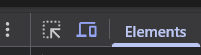

# Digital Invitation
## Disclaimer
If you're reading this you're probably not invited (sorry). Also don't worry I asked my sister for permission to ship this.

Also commits are very spaced because I've been procrastinating this for quite a long time.

This invite was designed intentionally for mobile, as it would be sent via social media, so I recommend using F12 and clicking this blue icon when reviewing the demo for a better experience:

Also the page is in spanish for obvious reasons, but i'll be translating every feature!

## General structure
I made this responsive invite using React + Vite and styling with TailwindCSS. It's hosted on Github Pages and redirected to a custom domain (angiexv.com.ar)

For the most It's a pretty basic react page that uses svgs and custom fonts. What's actually interesting is the forms I added:

### Attendance Form
Below the static info (place and date) you'll find a question with two buttons. This is where the user will confirm that they would be assisting to the event (Si) or if they won't be able to make it (No). When the user clicks Si a Form will appear asking them for their Name, Last Name, Id number (all fillable inuts) and an option field asking for diet restrictions (none, vegan, celiac, etc.).

### Music Form
A fun optional song suggestion form! It asks for the name and artist of a song.

## Data Storage
Every answer to each form is saved on a Google Sheets document using an App Script extension (see /google-app-script for code). Each form has it's own page on the document (I won't be sharing the document for obvious reasons but trust me it works!!)

I found this to be the most practical way (rather than a sql table or other more efficent storage options) because all this data is requested by the quince's venue and I found a Google Sheets document the easiest to share and use by non-devs.

## AI usage declaration
I used Cursor Agent to debug the App Script code
